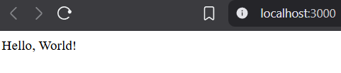
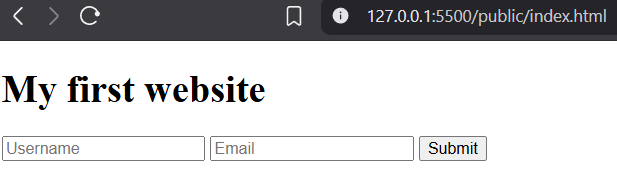

# Web App

## Demo





## Installation

Prerequisites: [Node.js](https://nodejs.org/en) and [Git](https://git-scm.com/).

1. Clone the repositorry from your terminal:

   ```bash
   $ git clone https://github.com/denyschr/web-app.git
   ```

2. Go to the root directory:

   ```bash
   $ cd web-app
   ```

3. Start the server:

   ```bash
   $ node src/index.js
   ```

4. The server will be running at http://localhost:3000.

5. Open public/index.html to see the static page.
